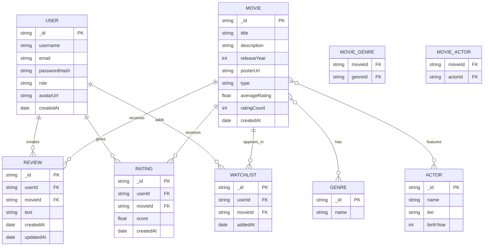

# IMDB Clone - Database Schema

## Entity Relationship Diagram

## Table Definitions

### USER
- **_id**: Primary key (string)
- **username**: User's unique username
- **email**: User's email address
- **passwordHash**: Hashed password for security
- **role**: User role (admin/user)
- **avatarUrl**: Profile picture URL
- **createdAt**: Account creation timestamp

### MOVIE
- **_id**: Primary key (string)
- **title**: Movie title
- **description**: Movie overview/synopsis
- **releaseYear**: Year of release
- **posterUrl**: Movie poster image URL
- **type**: Content type (movie/tv)
- **averageRating**: Calculated average rating
- **ratingCount**: Number of ratings received
- **createdAt**: Movie creation timestamp

### REVIEW
- **_id**: Primary key (string)
- **userId**: Foreign key to USER
- **movieId**: Foreign key to MOVIE
- **text**: Review content
- **createdAt**: Review creation timestamp
- **updatedAt**: Last update timestamp

### RATING
- **_id**: Primary key (string)
- **userId**: Foreign key to USER
- **movieId**: Foreign key to MOVIE
- **score**: Rating score (typically 1-5 or 1-10)
- **createdAt**: Rating creation timestamp

### WATCHLIST
- **_id**: Primary key (string)
- **userId**: Foreign key to USER
- **movieId**: Foreign key to MOVIE
- **addedAt**: When movie was added to watchlist

### GENRE
- **_id**: Primary key (string)
- **name**: Genre name (Action, Drama, etc.)

### ACTOR
- **_id**: Primary key (string)
- **name**: Actor's name
- **bio**: Actor biography
- **birthYear**: Actor's birth year

### MOVIE_GENRE (Junction Table)
- **movieId**: Foreign key to MOVIE
- **genreId**: Foreign key to GENRE

### MOVIE_ACTOR (Junction Table)
- **movieId**: Foreign key to MOVIE
- **actorId**: Foreign key to ACTOR

## Relationships

- Users can create multiple reviews, ratings, and watchlist entries
- Movies can have multiple reviews, ratings, and appear in multiple watchlists
- Movies can have multiple genres and feature multiple actors (many-to-many)
- Each review/rating/watchlist entry belongs to exactly one user and one movie

## Implementation Notes

- Uses MongoDB with Mongoose ODM
- Passwords are hashed using bcrypt
- Average ratings are calculated dynamically
- Junction tables (MOVIE_GENRE, MOVIE_ACTOR) implement many-to-many relationships
