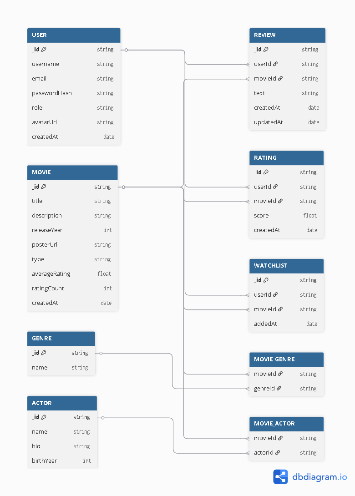

# IMDB Clone ER Diagram Image

## Database Schema Visualization

Below is the visual representation of the IMDB Clone database schema showing all entities and their relationships:

## Overview

This ER diagram illustrates the complete database structure for the IMDB Clone application, including:

### Core Entities
- **USER** - User accounts and authentication
- **MOVIE** - Movie and TV show catalog
- **GENRE** - Movie categories
- **ACTOR** - Cast information

### Relationship Tables
- **REVIEW** - User-written movie reviews
- **RATING** - Numerical movie ratings (1-10)
- **WATCHLIST** - User's personal movie collections
- **MOVIE_GENRE** - Junction table for movie-genre relationships
- **MOVIE_ACTOR** - Junction table for movie-actor relationships

### Key Relationships
- Users can write multiple reviews and rate multiple movies
- Movies can have multiple reviews, ratings, genres, and actors
- Many-to-many relationships are implemented through junction tables
- Each user has one personal watchlist

## Technical Details

- **Database**: MongoDB with Mongoose ODM
- **Relationships**: Implemented using ObjectId references
- **Junction Tables**: Enable many-to-many relationships between movies and genres/actors
- **Data Integrity**: Enforced at application level with proper validation

